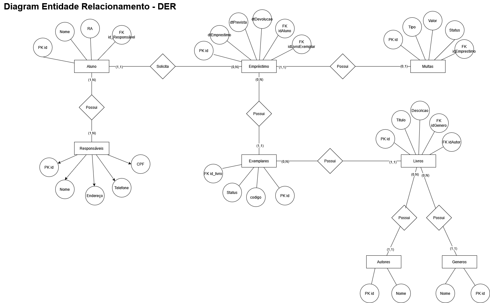

# Diagrama Entidade-Relacionamento (DER)

Esta seção apresenta o **Diagrama Entidade-Relacionamento (DER)** do sistema de controle de empréstimos da livraria escolar.

O DER representa a estrutura do banco de dados do sistema, demonstrando as entidades, seus atributos e os relacionamentos existentes entre elas. Esse diagrama é utilizado para modelar a organização dos dados, garantindo integridade, consistência e suporte às regras de negócio da aplicação.

---

## Diagrama Entidade-Relacionamento

