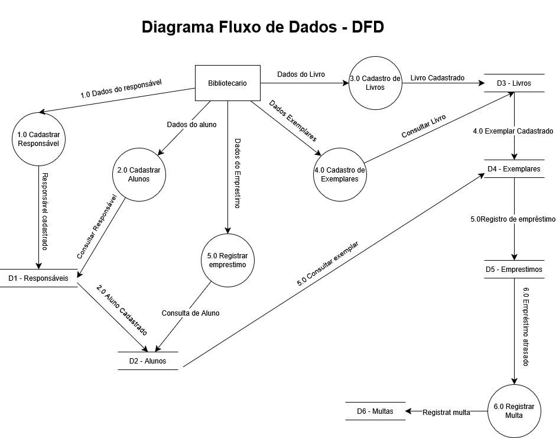

# Diagrama de Fluxo de Dados (DFD)

Esta seção apresenta o **Diagrama de Fluxo de Dados (DFD)** do sistema de controle de empréstimos da livraria escolar.

O DFD representa o fluxo das informações dentro do sistema, demonstrando como os dados são processados, armazenados e movimentados entre usuários, processos e banco de dados. Esse diagrama auxilia na compreensão do comportamento do sistema e da interação entre seus componentes funcionais.

---

## Diagrama de Fluxo de Dados

