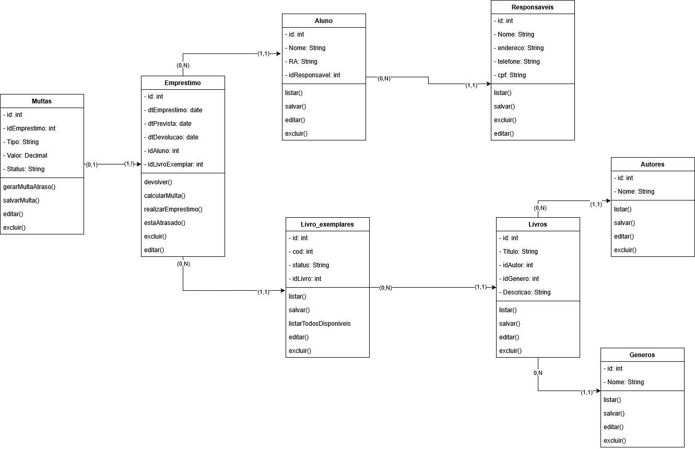

# Diagramas de Classe

Esta seção apresenta os diagramas de classe do sistema de controle de empréstimos da livraria escolar.

O **Diagrama Geral de Classes** representa a visão completa da estrutura do sistema, incluindo entidades, atributos, métodos e relacionamentos. Os diagramas fragmentados apresentam partes específicas do modelo para facilitar a visualização e compreensão dos componentes principais.

---

## Diagrama Geral de Classes

Este diagrama apresenta a estrutura completa do sistema, demonstrando o relacionamento entre todas as classes envolvidas.

---

## Diagrama de Classe - Aluno

Representa a estrutura da entidade **Aluno**, incluindo atributos, relacionamentos e responsabilidades dentro do sistema.

---

## Diagrama de Classe - Empréstimo

Representa a estrutura da entidade **Empréstimo**, evidenciando os dados e relacionamentos relacionados ao controle de empréstimos de livros.

---

## Diagrama de Classe - Livro

Representa a estrutura da entidade **Livro**, incluindo informações relacionadas ao acervo e gerenciamento dos exemplares.

